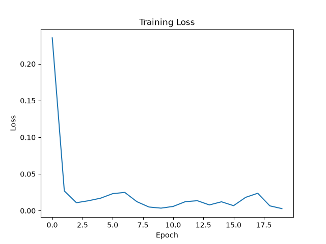
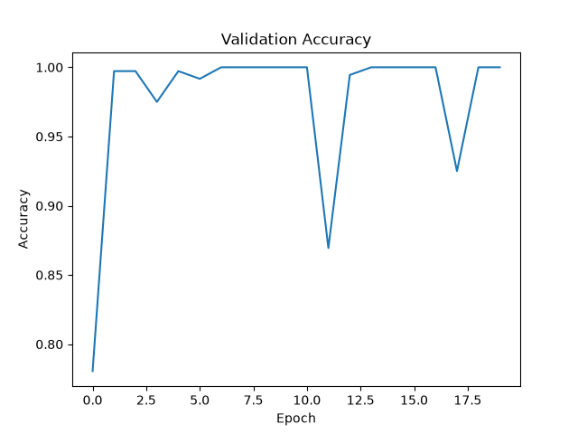
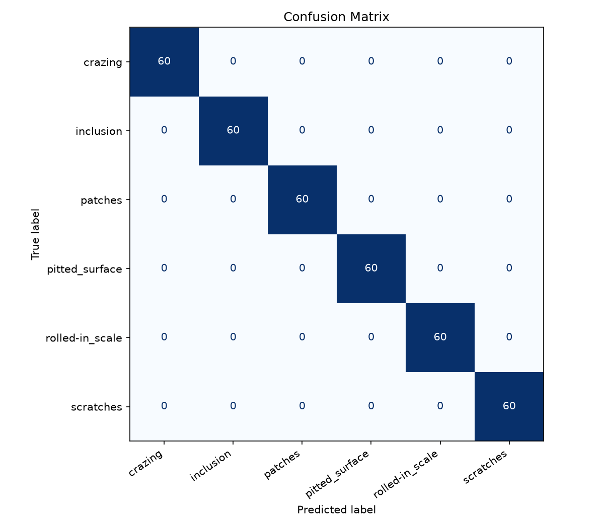

# AI Surface Defect Inspection

## 📌 Proje Hakkında

Bu proje, çelik yüzeylerde oluşan kusurların **Derin Öğrenme (Deep Learning)** teknikleri kullanılarak otomatik olarak sınıflandırılması amacıyla geliştirilmiştir.

Proje kapsamında **PyTorch** kütüphanesi kullanılarak görüntü sınıflandırma sistemi oluşturulmuş, **Transfer Learning** yaklaşımı ile **ResNet18** mimarisi yeniden eğitilmiştir.

Model geliştirme sürecinde yalnızca eğitim aşamasına odaklanılmamış; veri hazırlama, model oluşturma, eğitim, tahmin (Inference) ve model değerlendirme süreçleri birbirinden ayrılarak modüler ve sürdürülebilir bir proje mimarisi oluşturulmuştur.

---

# 🚀 Özellikler

* PyTorch tabanlı görüntü sınıflandırma sistemi
* Transfer Learning (ResNet18)
* GPU (CUDA) desteği
* Data Augmentation
* ImageFolder ve DataLoader kullanımı
* Eğitim (Training) ve doğrulama (Validation) süreçleri
* En başarılı modeli otomatik kaydetme (Model Checkpoint)
* Tek görüntü üzerinde tahmin (Inference)
* Confusion Matrix
* Classification Report
* Precision, Recall ve F1-Score değerlendirmeleri
* Eğitim Loss grafiği
* Validation Accuracy grafiği
* Modüler proje yapısı

---

# 📂 Proje Yapısı

```text
AI-Surface-Defect-Inspection/
│
├── dataset/
├── models/
│   └── best_model.pth
│
├── results/
│   └── plots/
│
├── src/
│   ├── config.py
│   ├── dataset.py
│   ├── model.py
│   ├── train.py
│   ├── inference.py
│   └── evaluate.py
│
├── requirements.txt
└── README.md
```

---

# 🛠️ Kullanılan Teknolojiler

* Python
* PyTorch
* TorchVision
* NumPy
* Matplotlib
* Scikit-learn
* Pillow

---

# 🧠 Model Mimarisi

Projede **ImageNet** veri kümesi üzerinde önceden eğitilmiş **ResNet18** mimarisi kullanılmıştır.

Transfer Learning yaklaşımı sayesinde modelin son tam bağlantılı (Fully Connected) katmanı, veri kümesindeki sınıf sayısına uygun olacak şekilde yeniden düzenlenmiş ve yalnızca sınıflandırma katmanı yeniden eğitilmiştir.

**Model Yapılandırması**

* Model: ResNet18
* Framework: PyTorch
* Transfer Learning
* Optimizer: Adam
* Loss Function: CrossEntropyLoss
* GPU (CUDA) desteği

---

# ⚙️ Eğitim Süreci

Model eğitimi aşağıdaki adımlardan oluşmaktadır:

1. Veri setinin yüklenmesi
2. Data Augmentation uygulanması
3. ResNet18 modelinin oluşturulması
4. Transfer Learning uygulanması
5. Eğitim (Training)
6. Doğrulama (Validation)
7. En başarılı modelin kaydedilmesi
8. Eğitim sonuçlarının görselleştirilmesi

Eğitim sonunda otomatik olarak;

* Training Loss Grafiği
* Validation Accuracy Grafiği

oluşturulmaktadır.

---

# 📈 Sonuçlar

Model değerlendirmesi, toplam **360 görüntüden** oluşan validation veri kümesi üzerinde gerçekleştirilmiştir. Elde edilen grafikler ve metrikler, modelin eğitim sürecindeki öğrenme davranışını ve doğrulama verisi üzerindeki sınıflandırma başarısını analiz etmek için kullanılmıştır.

## 📈 Eğitim Loss Grafiği



Training loss grafiği, modelin epoch bazında eğitim verisi üzerindeki hata değerinin nasıl değiştiğini göstermektedir. Loss değerindeki düşüş, modelin eğitim örneklerinden anlamlı özellikler öğrenerek optimizasyon sürecinde daha kararlı hale geldiğini göstermektedir.

---

## 📊 Validation Accuracy



Validation accuracy grafiği, modelin her epoch sonunda daha önce görmediği doğrulama verisi üzerindeki doğru sınıflandırma oranını göstermektedir. Bu grafik, modelin yalnızca eğitim verisine uyum sağlayıp sağlamadığını değil, aynı zamanda doğrulama verisine ne kadar iyi genelleme yaptığını değerlendirmek için önemlidir.

---

## 🔍 Confusion Matrix



Confusion matrix, gerçek sınıflar ile model tarafından tahmin edilen sınıflar arasındaki ilişkiyi ayrıntılı olarak göstermektedir. Diyagonal hücrelerde yoğunlaşan değerler, modelin sınıfları doğru ayırt ettiğini; diyagonal dışındaki değerler ise sınıflar arası karışıklıkları temsil etmektedir.

## Model Performance

Model, 360 görüntü içeren validation veri kümesi üzerinde çok yüksek performans göstermiştir.

* **Validation Accuracy:** Modelin validation veri kümesindeki genel doğru sınıflandırma oranını ifade eder. Bu çalışmada model, doğrulama örneklerinin tamamını doğru sınıflandırarak **1.00** validation accuracy değerine ulaşmıştır.
* **Precision:** Modelin belirli bir sınıfa ait olarak tahmin ettiği örneklerin ne kadarının gerçekten o sınıfa ait olduğunu gösterir. Bu projede **1.00** precision değeri elde edilmiş olup yanlış pozitif tahminlerin validation veri kümesi üzerinde gözlenmediğini göstermektedir.
* **Recall:** Her sınıfa ait gerçek örneklerin ne kadarının model tarafından doğru şekilde yakalandığını ifade eder. **1.00** recall değeri, modelin validation veri kümesindeki kusurlu yüzey sınıflarını eksiksiz şekilde yakaladığını göstermektedir.
* **F1-Score:** Precision ve recall metriklerinin harmonik ortalamasıdır. Bu metrik, özellikle sınıflandırma performansını dengeli biçimde değerlendirmek için kullanılır ve bu projede validation veri kümesi üzerinde **1.00** olarak hesaplanmıştır.

> Although the model achieved very high validation performance, further evaluation on larger and more diverse real-world datasets is recommended to better assess its generalization capability.

---

# 🔍 Model Değerlendirmesi

Eğitim tamamlandıktan sonra model, ayrı bir değerlendirme modülü kullanılarak analiz edilmektedir.

Değerlendirme kapsamında;

* Confusion Matrix
* Classification Report
* Precision
* Recall
* F1-Score

hesaplanmaktadır.

---

# 🖼️ Tahmin (Inference)

Eğitilmiş model kullanılarak tek bir görüntü üzerinde tahmin yapılabilmektedir.

Tahmin sürecinde;

* Görüntünün yüklenmesi
* Ön işleme (Preprocessing)
* Model tahmini
* Softmax olasılık hesaplaması
* Tahmin edilen sınıfın belirlenmesi
* Güven skorunun hesaplanması

işlemleri gerçekleştirilmektedir.

Örnek çıktı:

```text
Prediction : crazing
Confidence : 99.93%
```

---

# 🎯 Projenin Amacı

Bu proje aşağıdaki konularda uygulamalı deneyim kazanmak amacıyla geliştirilmiştir:

* Derin Öğrenme
* Bilgisayarlı Görü (Computer Vision)
* Transfer Learning
* Görüntü Sınıflandırma
* PyTorch
* Model Değerlendirme
* Profesyonel AI Proje Mimarisi

---

# 🚀 Gelecekte Yapılabilecek Geliştirmeler

* TensorBoard entegrasyonu
* ONNX model dönüşümü
* TensorRT optimizasyonu
* Grad-CAM görselleştirmesi
* Hyperparameter Optimization
* EfficientNet ve ConvNeXt gibi farklı mimarilerin eklenmesi

---

# 👨‍💻 Geliştirici

Bu proje, PyTorch kullanılarak Bilgisayarlı Görü (Computer Vision) ve Derin Öğrenme alanında uygulamalı deneyim kazanmak amacıyla geliştirilmiştir.
